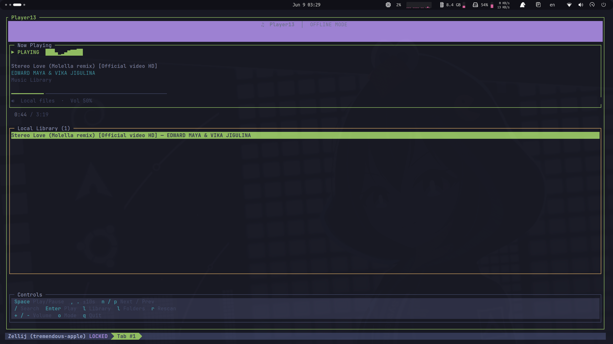

# 🎵 Player13

A retro-styled **terminal music player** with dual modes: stream from **Spotify** or play your **local music library** — all from the comfort of your terminal.

## 📸 Screenshot

<p align="center">
  
</p>

*Player13 running in offline mode — now playing, local library, and keyboard controls.*

---

## ✨ Features

- 🖥️ **Beautiful TUI** — cyberpunk-inspired interface with live visualizer, progress bar, and status display
- 🌐 **Spotify mode** — search tracks, browse playlists, and control playback on your active Spotify device
- 💾 **Offline mode** — scan and play local audio files from any folder on your machine
- 🔀 **Seamless switching** — toggle between Spotify and local library without restarting
- ⌨️ **Keyboard-driven** — fast navigation with vim-style list controls
- 🔊 **Full playback control** — play/pause, seek, skip, and volume adjustment
- 🎧 **Smart audio backend** — uses **mpv** (preferred) or **ffplay** for local playback

---

## 📋 Requirements

| Requirement | Notes |
|-------------|-------|
| **Node.js** ≥ 18 | [nodejs.org](https://nodejs.org/) |
| **mpv** or **ffplay** | Required for offline/local playback |
| **Spotify account** | Required for online mode only |
| **Spotify Premium** | Needed to control playback via the API |
| **Active Spotify device** | Desktop app, phone, or web player must be open |

### Install audio player (Linux)

```bash
# mpv (recommended)
sudo apt install mpv

# or ffplay (comes with ffmpeg)
sudo apt install ffmpeg
```

---

## 🚀 Quick Start

### 1. Clone & install

```bash
git clone <your-repo-url>
cd player13
npm install
```

### 2. Configure environment

```bash
cp .env.example .env
```

Edit `.env` with your settings:

```env
SPOTIFY_CLIENT_ID=your_client_id_here
SPOTIFY_CLIENT_SECRET=your_client_secret_here
SPOTIFY_REDIRECT_URI=https://127.0.0.1:8888/callback
MUSIC_FOLDER=/path/to/your/music
```

> 💡 `MUSIC_FOLDER` defaults to `./music` if not set. Point it to wherever your audio files live.

### 3. Set up Spotify (online mode)

1. Go to the [Spotify Developer Dashboard](https://developer.spotify.com/dashboard)
2. Create a new app
3. Copy the **Client ID** and **Client Secret** into your `.env`
4. Add `https://127.0.0.1:8888/callback` as a **Redirect URI** in your app settings
5. Authenticate:

```bash
npm run auth
```

Your browser will open for Spotify login. Accept the certificate warning (local HTTPS) and authorize the app. Tokens are saved to `.spotify-tokens.json`.

### 4. Launch 🎶

```bash
# Full player (Spotify + offline fallback)
npm start

# Offline / local library only
npm run offline
```

If Spotify credentials are missing or auth fails, Player13 automatically falls back to **offline mode**.

---

## ⌨️ Keyboard Shortcuts

### Playback

| Key | Action |
|-----|--------|
| `Space` | Play / Pause |
| `,` `.` | Seek −10s / +10s |
| `Shift` + `←` `→` | Seek −10s / +10s |
| `n` | Next track |
| `p` | Previous track |
| `+` `=` / `-` | Volume up / down |

### Library & Search

| Key | Action |
|-----|--------|
| `/` | Search tracks *(Spotify mode)* |
| `Enter` | Play selected track |
| `l` | Open playlists *(Spotify)* or local library *(offline)* |
| `r` | Rescan music folder *(offline only)* |

### System

| Key | Action |
|-----|--------|
| `o` | Toggle Spotify ↔ Offline mode |
| `q` / `Ctrl+C` | Quit |

Use **↑** **↓** or **j** **k** to navigate lists. Click with the mouse also works.

---

## 🎧 Supported Audio Formats (Offline)

`.mp3` · `.flac` · `.ogg` · `.wav` · `.m4a` · `.aac` · `.opus` · `.webm`

Files are scanned recursively from `MUSIC_FOLDER`. Track metadata is parsed from filenames like `Artist - Title.mp3`.

---

## 🌐 Spotify Mode Tips

- 🎯 **Open Spotify first** — make sure a device (desktop, mobile, or web) is active before playing
- 🔍 **Search** — press `/` to find any track in Spotify's catalog
- 📂 **Playlists** — press `l` to browse your playlists, then `Enter` to open one
- 🔄 **Token refresh** — access tokens renew automatically; re-run `npm run auth` if login expires

---

## 💾 Offline Mode Tips

- 📁 Drop audio files into your `MUSIC_FOLDER` (subfolders are supported)
- 🔄 Press `r` after adding new files to rescan the library
- 🎵 Press `l` to view all local tracks, then `Enter` to play
- 🔀 Press `o` to switch to Spotify mode when you're back online

---

## 📜 NPM Scripts

| Command | Description |
|---------|-------------|
| `npm start` | Launch player (Spotify preferred, offline fallback) |
| `npm run offline` | Launch in offline/local mode only |
| `npm run auth` | Authenticate with Spotify (one-time setup) |

---

## 🛠️ Project Structure

```
player13/
├── src/
│   ├── index.js      # Entry point & mode selection
│   ├── ui.js         # Terminal UI (blessed)
│   ├── spotify.js    # Spotify API player
│   ├── offline.js    # Local file player (mpv/ffplay)
│   ├── auth.js       # Spotify OAuth flow
│   └── config.js     # Environment & paths
├── screens/          # Screenshots
├── .env.example      # Environment template
└── package.json
```

---

## 🐛 Troubleshooting

| Problem | Fix |
|---------|-----|
| `Missing Spotify credentials` | Copy `.env.example` → `.env` and fill in your app credentials |
| `No audio player found` | Install mpv: `sudo apt install mpv` |
| Spotify shows "No active playback" | Open the Spotify app on any device and start playing something |
| Browser cert warning on auth | Expected for local HTTPS — click through to proceed |
| Empty local library | Check `MUSIC_FOLDER` path in `.env` and press `r` to rescan |
| 403 / API blocked errors | Spotify may restrict API access; use offline mode with `npm run offline` |

---

## 📄 License

MIT

---

Made with 💜 for LINUX terminal lovers.

XIII - Kuro Neko
